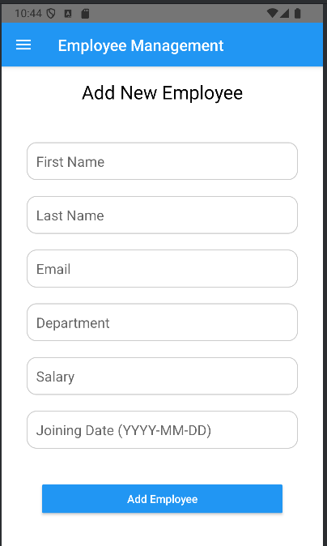

---

# **Employee Management System - Admin Application**

## **Overview**
This is a client-side Android application designed for managing employee records via a RESTful API. The app provides an intuitive interface for administrators to perform CRUD operations on employee data, ensuring seamless integration with the backend system.

Key features include:
- Viewing all employees.
- Retrieving details of a specific employee.
- Adding, updating, and deleting employee records.
- API health check functionality.


The app is developed in **Java** using **Android Studio**, following best practices and design patterns to ensure maintainability and scalability.

---

## **Features**
### **1. View All Employees**
- **Endpoint**: `GET /employees`
- Displays a list of all employees in a user-friendly interface.

### **2. View Employee by ID**
- **Endpoint**: `GET /employees/get/<id>`
- Retrieves and displays detailed information about a specific employee.

### **3. Add New Employee**
- **Endpoint**: `POST /employees/add`
- Allows admins to add new employees by filling in a form with required details.

### **4. Update Employee Details**
- **Endpoint**: `PUT /employees/edit/<id>`
- Enables editing of employee records with real-time validation.

### **5. Delete Employee**
- **Endpoint**: `DELETE /employees/delete/<id>`
- Provides functionality to remove employee records with confirmation dialogs.

### **6. API Health Check**
- **Endpoint**: `GET /health`
- Ensures that the API is operational before interacting with it.

---

## **Technical Stack**
### **Programming Language**
- Java

### **Frameworks and Libraries**
- Android SDK
- Material Design Components
- Volley (for API requests)

### **Design Patterns**
- Singleton Pattern (e.g., `MySingleton.java`)
- Adapter Pattern (e.g., `EmployeeAdapter.java`)

---

## **Installation and Setup**
### **Prerequisites**
1. Android Studio (latest version).
2. Java Development Kit (JDK 8+).
3. Internet connection to access the RESTful API.

### **Steps**
1. Clone the repository:
   ```bash
   git clone https://github.com/Plymouth-COMP2000/coursework-report-SaadAlsuabie.git
   ```
2. Open the project in Android Studio.
3. Configure the `BASE_URL` in `EmployeeDataService.java`:
   ```java
   private static final String BASE_URL = "http://10.224.41.11/comp2000";
   ```
4. Build and run the application on an Android emulator or physical device.

---

## **Usage**
1. **Dashboard**: View an overview of the app’s functionality.
2. **Employee Management**:
   - Use the navigation menu to access features like adding, updating, or deleting employees.


---

## **API Integration**
The app interacts with the following API endpoints:

| Feature              | HTTP Method | Endpoint                      |
|----------------------|-------------|-------------------------------|
| Get All Employees    | `GET`       | `/employees`                 |
| Get Employee by ID   | `GET`       | `/employees/get/<id>`        |
| Add New Employee     | `POST`      | `/employees/add`             |
| Update Employee      | `PUT`       | `/employees/edit/<id>`       |
| Delete Employee      | `DELETE`    | `/employees/delete/<id>`     |
| API Health Check     | `GET`       | `/health`                    |

---

## **Screenshots**
### Dashboard


### Employee List

### Add Employee



---

## **Testing and Evaluation**
### **Usability Evaluation**
- Conducted usability tests with two users.
- Feedback incorporated to improve:
  - Navigation flow.
  - Form validation and error handling.

### **Testing**
- Unit tests for data service methods.
- Instrumentation tests for UI components.

---

## **Future Enhancements**
1. Role-based access control for enhanced security.
2. Offline functionality for storing and syncing employee data.

---

## **GitHub Repository**
- **Repository URL**: [GitHub Repository](https://github.com/Plymouth-COMP2000/coursework-report-SaadAlsuabie.git)
- **Commit Guidelines**:
  - Each commit is appropriately commented and pushed weekly.
  - All third-party assets and resources are credited in the README file.

---

## **Credits**
### **Developer**
- Saad Alsuabie - Admin Application Developer

### **Acknowledgements**
- [University Of Plymouth](https://www.plymouth.ac.uk/) - Provided API and project requirements.
- Open-source libraries like **Volley** and **Material Design Components**.

---